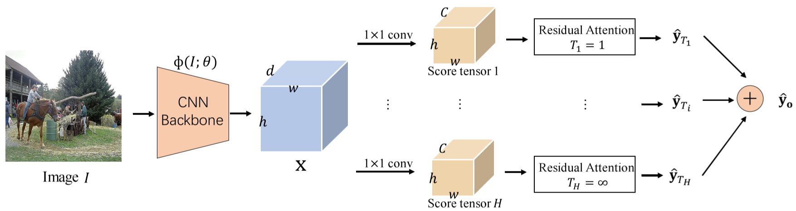
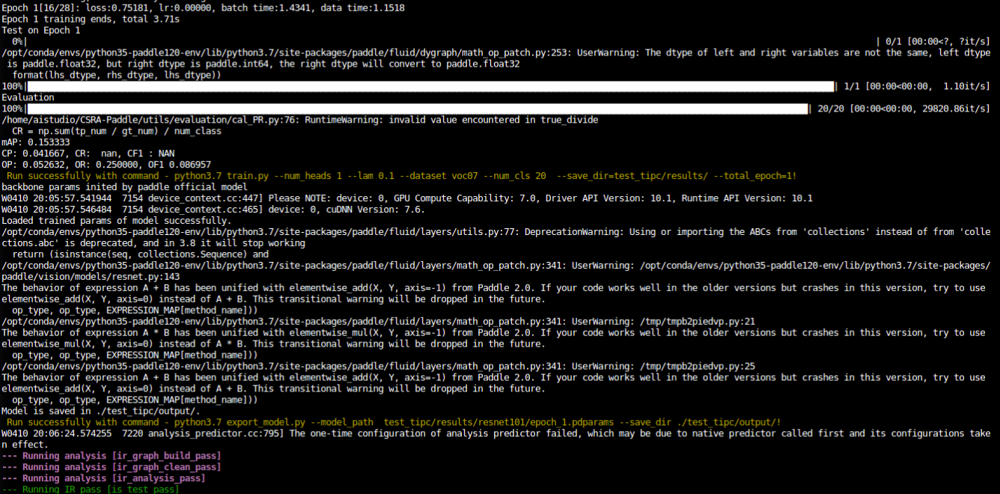
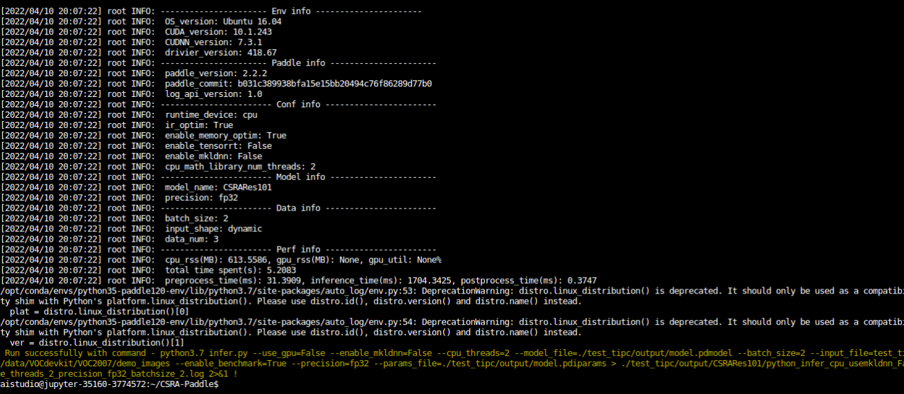
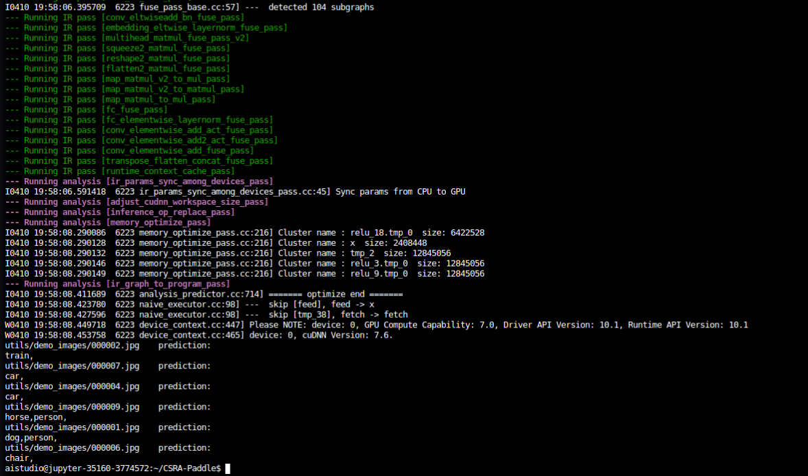

  简体中文 | [English](README_EN.md)

# CSRA-Paddle

## 1 简介
This is the unofficial code based on **PaddlePaddle** of ICCV 2021 paper:<br>
Residual Attention: A Simple But Effective Method for Multi-Label Recoginition<br>



为了有效地捕捉来自不同类别的对象所占据的不同空间区域，这篇文章提出了一个非常简单的模块，称为类特定的残余注意力（CSRA）。
CSRA通过提出一个简单的空间注意力分数为每个类别生成特定于类的特征，然后将其与与类别无关的平均池化特征相结合。CSRA 在多标签识别上取得了 state-of-the-art 的结果，同时相比于其他方法简单得多。

本项目基于PaddlePaddle框架复现了CSRA，并在Pascal VOC数据集上进行了实验。
**论文：**
- [1] Zhu, K. , and J. Wu . [Residual Attention: A Simple But Effective Method for Multi-Label Recoginition](https://arxiv.org/abs/2108.02456). ICCV, 2021. 

**项目参考：**
- [https://github.com/Kevinz-code/CSRA](https://github.com/Kevinz-code/CSRA)

## 2 复现精度
>在Pascal VOC 2007 val数据集的测试效果如下表。

|NetWork |epochs|opt|lr|resolution|batch_size|dataset|card|mAP|weight|log|
| :---: | :---: | :---: |:---: | :---: | :---: | :---: | :---: | :---: | :---: | :---: |
|Resnet101+CSRA|30|SGD|0.01|448x448|16|VOC2007|1xV100|94.7(94.697)|(链接: https://pan.baidu.com/s/1FAJGVQRpOj_gdG8m70Qwqg?pwd=4w2u 提取码: 4w2u 复制这段内容后打开百度网盘手机App，操作更方便哦)|[log](output/train.log)|

AIStudio预训练权重：[AIStudio预训练权重](https://aistudio.baidu.com/aistudio/datasetdetail/137949)

## 3 数据集
数据集网站：[Pascal VOC](http://host.robots.ox.ac.uk/pascal/VOC/voc2007/index.html)

AiStudio上的数据集：[pascal-voc](https://aistudio.baidu.com/aistudio/datasetdetail/4379)
```
PATH/Dataset/
|-- VOCdevkit/
|---- VOC2007/
|------ JPEGImages/
|------ Annotations/
|------ ImageSets/
```
注：PATH/Dataset/为数据集的路径

## 4 环境依赖
- 硬件: Tesla V100 16G >= 1

- 框架:
    - PaddlePaddle >= 2.2.0
    
## 快速开始

### 第一步：克隆本项目
```bash
# clone this repo
git clone git@github.com:CuberrChen/CSRA-Paddle.git
cd CSRA-Paddle
```

- 安装依赖
```bash
pip install -r requirements.txt
```
### 第二步：准备数据

然后直接运行以下命令生成数据集的json文件（**注意修改PATH/Dataset**）
```shell
python utils/prepare/prepare_voc.py  --data_path PATH/Dataset/VOCdevkit
```
这将自动在*./data/voc07*中生成注释json文件

### 第三步：训练模型

开始训练：

```bash
python train.py --num_heads 1 --lam 0.1 --dataset voc07 --num_cls 20 --save_dir=./checkpoint
```

### 第四步：验证
需要指定训练好的模型参数路径
```bash
python val.py --model resnet101 --num_heads 1 --lam 0.1 --dataset voc07 --num_cls 20  --load_from /PATH/MODEL.pdparams
```

### 第五步：预测
这里以**样例图片为例，存放在utils/demo_images中**
```shell
python predict.py --model resnet101 --num_heads 1 --lam 0.1 --dataset voc07 --load_from OUR_VOC_PRETRAINED.pth --img_dir utils/demo_images
```
对于每张图像的预测输出形式如下:
```shell
utils/demo_images/000002.jpg prediction: train,
utils/demo_images/000007.jpg prediction: car,
utils/demo_images/000004.jpg prediction: car,
utils/demo_images/000009.jpg prediction: horse,person,
utils/demo_images/000001.jpg prediction: dog,person,
utils/demo_images/000006.jpg prediction: chair,
...
```

### 第六步：TIPC

**详细日志在test_tipc/output**

TIPC: [TIPC: test_tipc/README.md](test_tipc/README.md)

首先安装auto_log，需要进行安装，安装方式如下：
auto_log的详细介绍参考https://github.com/LDOUBLEV/AutoLog。
```shell
git clone https://github.com/LDOUBLEV/AutoLog
cd AutoLog/
pip3 install -r requirements.txt
python3 setup.py bdist_wheel
pip3 install ./dist/auto_log-1.2.0-py3-none-any.whl
```
进行TIPC：
```bash
bash test_tipc/prepare.sh test_tipc/configs/CSRARes101/train_infer_python.txt 'lite_train_lite_infer'

bash test_tipc/test_train_inference_python.sh test_tipc/configs/CSRARes101/train_infer_python.txt 'lite_train_lite_infer'
```
TIPC结果：

**tipc测试结果截图**

训练&&导出


推理



**注意：由于代码中每次训练需要生成数据集的标签json文件，进行tipc会覆盖原来data目录下的json文件，所以进行tipc后要进行完整训练的话。需要重新为完整数据集生成json文件，也就是重新执行数据准备的步骤**

- 预训练模型的导出与推理测试：

```shell
python export_model.py --model resnet101 --num_heads 1 --lam 0.1 --img_size=448 --model_path=./output/epoch_11.pdparams --save_dir=./output```
```

```shell
python infer.py --use_gpu=True --model_file=output/model.pdmodel --input_file=utils/demo_images --params_file=output/model.pdiparams
```
预测输出如下：


结果与动态图预测结果一致。

## 5 代码结构与说明
**代码结构**
```
├── data
├── datasets
├── models
├── utils
├── test_tpic
├── README.md
├── train.py
├── val.py   
├── predict.py
├── export_model.py
├── infer.py
└── requirements.txt              
```

## 6 模型信息

相关信息:

| 信息 | 描述 |
| --- | --- |
| 作者 | xbchen|
| 日期 | 2022年4月 |
| 框架版本 | PaddlePaddle==2.2.1 |
| 应用场景 | 图像分类 |
| 硬件支持 | GPU、CPU |
| 在线体验 | [notebook](https://aistudio.baidu.com/aistudio/projectdetail/3774572)|

## 7 说明

- 对于数据集coco和WIDER,请参考原文项目实施进行修改。
- 感谢百度提供的算力支持。