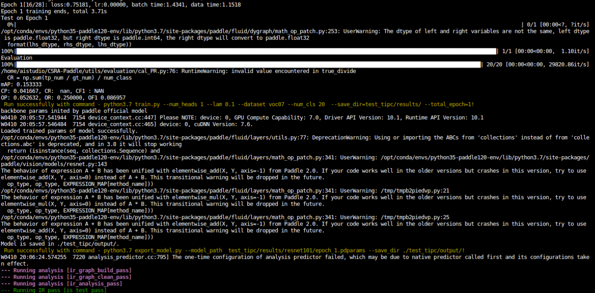

  [简体中文](README.md) | English

# CSRA-Paddle

## 1 简介
This is the unofficial code based on **PaddlePaddle** of ICCV 2021 paper:<br>
Residual Attention: A Simple But Effective Method for Multi-Label Recoginition<br>


In order to effectively capture the different spatial areas occupied by objects from different categories, this paper proposes a very simple module called class specific residual attention (CSRA).

CSRA generates class specific features for each category by proposing a simple spatial attention score, and then combines it with the average pooling features independent of the category. CSRA achieves the result of state of the art in multi tag recognition, and is much simpler than other methods.
This project reproduced CSRA based on the PaddlePaddle framework and carried out experiments on the Pascal VOC dataset.
**Paper：**
- [1] Zhu, K. , and J. Wu . [Residual Attention: A Simple But Effective Method for Multi-Label Recoginition](https://arxiv.org/abs/2108.02456). ICCV, 2021. 

**Reference：**
- [https://github.com/Kevinz-code/CSRA](https://github.com/Kevinz-code/CSRA)

## 2 Metric
>The test results of Pascal VOC 2007 Val dataset are shown in the table below 。

|NetWork |epochs|opt|lr|resolution|batch_size|dataset|card|mAP|weight|log|
| :---: | :---: | :---: |:---: | :---: | :---: | :---: | :---: | :---: | :---: | :---: |
|Resnet101+CSRA|30|SGD|0.01|448x448|16|VOC2007|1xV100|94.7(94.697)|(链接: https://pan.baidu.com/s/1FAJGVQRpOj_gdG8m70Qwqg?pwd=4w2u 提取码: 4w2u 复制这段内容后打开百度网盘手机App，操作更方便哦)|[log](output/train.log)|

Pre-trained wight on AIStudio：[weight](https://aistudio.baidu.com/aistudio/datasetdetail/137949)

## 3 Datasets
official website：[Pascal VOC](http://host.robots.ox.ac.uk/pascal/VOC/voc2007/index.html)

Datasets on AiStudio：[pascal-voc](https://aistudio.baidu.com/aistudio/datasetdetail/4379)
```
PATH/Dataset/
|-- VOCdevkit/
|---- VOC2007/
|------ JPEGImages/
|------ Annotations/
|------ ImageSets/
```

## 4 Environment

- Hardware: Tesla V100 16G >= 1

- Frame:
    - PaddlePaddle >= 2.2.0
    
## Quick start

### Step 1: clone the project

```bash
# clone this repo
git clone git@github.com:CuberrChen/CSRA-Paddle.git
cd CSRA-Paddle
```

- Installation dependency

```bash
pip install -r requirements.txt
```
### Step 2: prepare data

Then directly run the following command to generate the JSON file of the dataset (**Note to modify the path / dataset**)
```shell
python utils/prepare/prepare_voc.py  --data_path PATH/Dataset/VOCdevkit
```

### Step 3: Train

```bash
python train.py --num_heads 1 --lam 0.1 --dataset voc07 --num_cls 20 --save_dir=./checkpoint
```

### Step 4: Val

```bash
python val.py --model resnet101 --num_heads 1 --lam 0.1 --dataset voc07 --num_cls 20  --load_from /PATH/MODEL.pdparams
```

### Step 5: predict
```shell
python predict.py --model resnet101 --num_heads 1 --lam 0.1 --dataset voc07 --load_from OUR_VOC_PRETRAINED.pth --img_dir utils/demo_images
```

The prediction output form for each image is as follows:
```shell
utils/demo_images/000002.jpg prediction: train,
utils/demo_images/000007.jpg prediction: car,
utils/demo_images/000004.jpg prediction: car,
utils/demo_images/000009.jpg prediction: horse,person,
utils/demo_images/000001.jpg prediction: dog,person,
utils/demo_images/000006.jpg prediction: chair,
...
```

### Step 6:TIPC

**log  in test_tipc/output**

TIPC: [TIPC: test_tipc/README.md](test_tipc/README.md)

Install Auto first_ Log, which needs to be installed as follows ：https://github.com/LDOUBLEV/AutoLog。
```shell
git clone https://github.com/LDOUBLEV/AutoLog
cd AutoLog/
pip3 install -r requirements.txt
python3 setup.py bdist_wheel
pip3 install ./dist/auto_log-1.2.0-py3-none-any.whl
```
TIPC：
```bash
bash test_tipc/prepare.sh test_tipc/configs/CSRARes101/train_infer_python.txt 'lite_train_lite_infer'

bash test_tipc/test_train_inference_python.sh test_tipc/configs/CSRARes101/train_infer_python.txt 'lite_train_lite_infer'
```
TIPC result：

train&&export


infer


**Note: since the tag JSON file of the data set needs to be generated for each training in the code, the JSON file in the original data directory will be overwritten by TIPC, so complete training is required after TIPC. You need to regenerate the JSON file for the complete dataset, that is, re perform the steps of data preparation**

- export && infer of pre training model ：
```shell
python export_model.py --model resnet101 --num_heads 1 --lam 0.1 --img_size=448 --model_path=./output/epoch_11.pdparams --save_dir=./output```
```

```shell
python infer.py --use_gpu=True --model_file=output/model.pdmodel --input_file=utils/demo_images --params_file=output/model.pdiparams
```


The results are consistent with the prediction results of dynamic graph

## 5 Code structure and description
```
├── data
├── datasets
├── models
├── utils
├── test_tpic
├── README.md
├── train.py
├── val.py   
├── predict.py
├── export_model.py
├── infer.py
└── requirements.txt              
```

## 6 Model info

| Info | - |
| --- | --- |
| author | xbchen|
| date | 2022年4月 |
| Frame | PaddlePaddle==2.2.1 |
| Application | classification|
| Hardware| GPU、CPU |
| Online| [notebook](https://aistudio.baidu.com/aistudio/projectdetail/3774572)|

## 7 Note

- For data sets coco and wider, please refer to the original project implementation [https://github.com/Kevinz-code/CSRA](https://github.com/Kevinz-code/CSRA)
 for modification
- Thank Baidu for its support